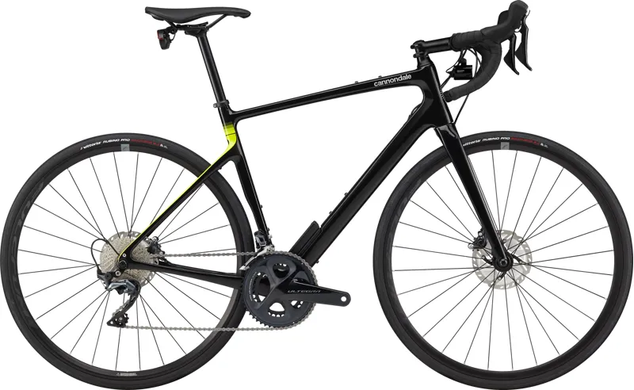

# Cannondale Synapse Carbon 2 RL — New from Dealer

**Price:** €2,899 (was €4,699)  
**Seller:** Rijwielshop Elfring (Wehl, 19 yr on Marktplaats)  
**Condition:** New  
**Link:** [View on Marktplaats](https://www.marktplaats.nl/v/fietsen-en-brommers/fietsen-racefietsen/m2393516834-cannondale-synapse-carbon-2-rl-framematen-56-58-en-61-nieuw)

---

## Specs

| Component | Detail |
|---|---|
| **Frame** | Carbon, SmartSense compatible |
| **Fork** | Carbon |
| **Groupset** | Shimano Ultegra R8000, 2×11 mechanical |
| **Crankset** | 50/34T |
| **Cassette** | Shimano Ultegra HG800, 11-34 (1:1 low gear ✓) |
| **Brakes** | Shimano Ultegra hydraulic disc, 160/160mm |
| **Wheels** | Fulcrum Rapid Red 900 |
| **Tyres** | Vittoria Rubino Pro 700×30C |
| **Weight** | ~8.5-8.8 kg (est.) |
| **Tyre clearance** | ~35 mm |
| **Available sizes** | 56, 58, 61 cm — **too large for 169cm (need 51cm)** |

## Alpe d'Huez Assessment

| Requirement | Status |
|---|---|
| **Budget (€2k–€3k)** | ✓ €2,899 |
| **Endurance geometry** | ✓ Synapse = classic endurance geometry |
| **Disc brakes** | ✓ Ultegra hydraulic |
| **Gearing ≤1:1** | ✓ 34/34 = 1.0 (50/34 + 11-34 confirmed) |
| **Tyre clearance ≥32mm** | ✓ ~35 mm |
| **Carbon frame** | ✓ |

## Pros

- **Ultegra groupset** — one step above 105, smoother mechanical shifting
- **Big discount** — €4,699 → €2,899 (38% off)
- **SmartSense system** — integrated front/rear lights, radar-ready
- **Multiple sizes** (56, 58, 61) — good for taller riders
- **Cannondale quality** — well-established brand with good NL dealer support
- **50/34 compact crankset** — climbing-friendly

## Cons

- **2×11 speed** (not 12-speed) — older groupset generation, though Ultegra is excellent
- **€2,899 is at budget ceiling** — leaves less room for clip-on bars + bike fit
- **Tyre clearance ~35 mm** — behind Giant Defy (40 mm) or Roubaix (40 mm)
- **No Di2** — Ultegra mechanical is great but at this price you can get 105 Di2 (Cube Attain C:62 SLX)
- **SmartSense integration** adds weight/complexity if you don't use it

## Gearing Detail

Confirmed: **50/34 + 11-34** = **1:1 lowest gear** ✓. No cassette swap needed for Alpe d'Huez. At 60 rpm on the steepest 13% sections you'll be doing ~5.5 km/h.

## Comparison to Cube Attain C:62 SLX (€2,499)

| Factor | Cannondale Synapse C 2 RL | Cube Attain C:62 SLX |
|---|---|---|
| **Price** | €2,899 | **€2,499** (€400 less) |
| **Groupset** | Ultegra 2×11 mech | **105 Di2** (electronic) |
| **Weight** | ~8.5-8.8 kg | 8.4 kg |
| **Tyre clearance** | ~35 mm | 34 mm |
| **Gearing** | 50/34 + 11-34 (1:1 ✓) | 50/34 + 11-34 (1:1 ✓) |
| **Warranty** | Dealer (likely limited) | **6 years** (Cube) |

The Cube is cheaper, has **electronic shifting**, and a longer warranty. The Cannondale has an Ultegra groupset (mechanical upgrade over 105) and SmartSense integrated lights/radar.

## Verdict

**Best for:** Cannondale fans who want Ultegra mechanical shifting and don't mind paying near the top of budget. The 1:1 gearing is confirmed, no cassette swap needed.

**Skip if:** You want electronic shifting (Cube Attain C:62 SLX is €400 less with Di2).

---

*Last updated: May 2026 — Listing active at time of writing.*
