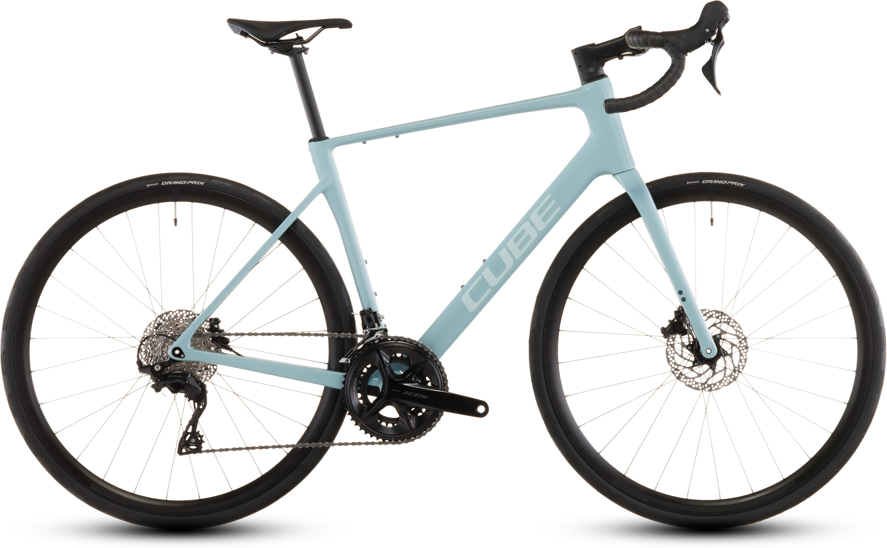

# Cube Attain C:62 Race — €1,699 (New, Dealer)

## Specs

| Spec | Detail |
|---|---|
| **Price** | **€1,699** — new, dealer, incl. VAT |
| **Frame** | C:62 Carbon (Twin Mold), 34mm tyre clearance |
| **Groupset** | Shimano 105 R7100, **2x12 mechanical** |
| **Brakes** | 105 BR-R7170, hydraulic disc, 160mm |
| **Wheels** | ACID SLX RA 2.3 Aero Disc, alloy, tubeless ready |
| **Tyres** | Continental Grand Prix, 30mm |
| **Cockpit** | ACID Road Omne, alloy |
| **Seatpost** | CUBE Performance Post, alloy |
| **Weight** | **9.2 kg** |
| **Sizes** | 47, 50, 53, 56, 58, 60, 62 cm |

## Why It Works for Alpe d'Huez

- **Same carbon frame as SLX** — just heavier build kit
- **Same 50/34 + 11-34 gearing** — 1:1 for climbing
- **Mechanical 105** — reliable, easy to maintain, cheaper to repair if something breaks mid-trip
- **€800 cheaper than SLX** — spend savings on clip-on bars + bike fit + a used carbon wheelset

## Marktplaats Listings

| Seller | Price | Condition | Link |
|---|---|---|---|
| Mutsaars Bikes (Schijndel/Veldhoven) | €1,699 | New, all sizes | [View listing →](https://www.marktplaats.nl/v/fietsen-en-brommers/fietsen-racefietsen/m2397717294-cube-attain-c-62-race-carbon-racefiets-shimano-105-1699) |
| Various dealers | ~€1,699 | New 2026, available in size 50 | [Search NL-wide (size 50) →](https://www.marktplaats.nl/q/cube+attain+c+62+race+maat+50/) |

## Budget Build Option

| Item | Cost |
|---|---|
| Cube Attain C:62 Race | €1,699 |
| Clip-on aero bars | €100 |
| Used carbon wheels (e.g. 50mm) | ~€500-800 |
| Professional bike fit | €200 |
| **Total** | **~€2,499-2,799** |

You end up with the same frame as the SLX, better wheels, and mechanical 105 instead of Di2. Lighter wheels make a bigger difference on Alpe d'Huez than electronic shifting.
