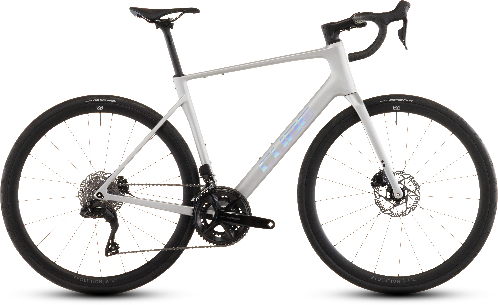

# Cube Attain C:62 SLX — €2,499 (New, Dealer)

## Specs

| Spec | Detail |
|---|---|
| **Price** | **€2,499** — new, dealer, incl. VAT |
| **Frame** | C:62 Carbon (Twin Mold), 34mm tyre clearance |
| **Groupset** | Shimano **105 Di2** R7170, **2x12 electronic** |
| **Brakes** | 105 BR-R7170, hydraulic disc, 160mm |
| **Wheels** | Newmen Evolution SL R.35, tubeless ready |
| **Tyres** | Continental Grand Prix, 30mm |
| **Cockpit** | Newmen Advanced Wing Bar (carbon) |
| **Seatpost** | Newmen Advanced, carbon, 27.2mm |
| **Weight** | **8.4 kg** |
| **Sizes** | 47, 50, 53, 56, 58, 60, 62 cm |

## Why It Works for Alpe d'Huez

- **Endurance geometry** — comfortable, back-friendly for 180km
- **50/34 + 11-34** — 1:1 climbing gear for 13% gradients
- **105 Di2** — electronic shifting, no missed shifts when exhausted
- **Hydraulic disc brakes** — safe on alpine descents
- **Carbon cockpit** — absorbs road vibration

## Marktplaats Listings

| Seller | Price | Condition | Link |
|---|---|---|---|
| Mutsaars Bikes (Schijndel/Veldhoven) | €2,499 | New, all sizes | [View listing →](https://www.marktplaats.nl/v/fietsen-en-brommers/fietsen-racefietsen/m2320398844-cube-attain-c-62-slx) |
| Various dealers | ~€2,499 | New 2026, available in size 50 | [Search NL-wide (size 50) →](https://www.marktplaats.nl/q/cube+attain+c+62+slx+maat+50/) |

## Verdict

**Best value electronic shifting.** At €2,499, this is the cheapest way to get 105 Di2 on a carbon endurance frame. Add clip-on tri bars (€100) and a bike fit (€200) and you're race-ready for ~€2,800.
