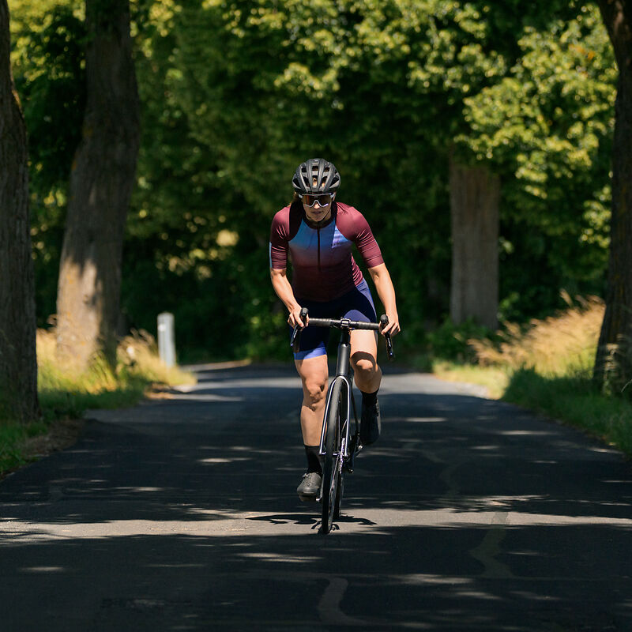

# Cube Attain GTC SL Disc — Used, ~€1,500

*Image representative of the GTC SL model (aluminium frame, carbon fork)*

## Typical Spec (Used)

| Spec | Detail |
|---|---|
| **Price** | **~€1,500** used |
| **Frame** | Aluminium 6061 Superlite, 32mm tyre clearance |
| **Fork** | Attain C:62, full carbon |
| **Groupset** | Shimano 105 R7100, **2x12 mechanical** (or older 2x11) |
| **Brakes** | Hydraulic disc |
| **Wheels** | Various (often upgraded to Fulcrum/DT Swiss) |
| **Tyres** | Various, 28-30mm |
| **Cockpit** | CUBE alloy |
| **Weight** | **~9.0-9.6 kg** |

## Why Buy Used

- **Cheapest path to a race-ready bike** for Alpe d'Huez
- Often comes with upgrades (wheels, tyres) already fitted
- The aluminium frame is comfortable — slim seatstays absorb vibration
- Carbon fork saves weight and improves ride quality

## What to Check Before Buying

- Cassette and chain wear (budget €100-200 if worn)
- Brake pads (budget €30-60)
- Tyre condition (budget €80-150 for new)
- Confirm **50/34 crankset + 11-34 cassette** (needed for climbing)
- Check frame size and fit

## Marktplaats Listings

| Advert | Price | Size | Link |
|---|---|---|---|
| Cube Attain GTC SL — your size | ~€1,500 | — | Search all NL, add "maat 50" | [Search NL-wide →](https://www.marktplaats.nl/q/cube+attain+gtc+sl+maat+50/) |
| Cube Attain SL disc — your size | ~€600-800 | — | Budget option, search all NL | [Search NL-wide →](https://www.marktplaats.nl/q/cube+attain+sl+disc+maat+50/) |
| Cube Attain GTC/SL carbon — your size | ~€1,200-1,800 | — | Search all NL, try different terms | [Search all →](https://www.marktplaats.nl/q/cube+attain+maat+50/) |

**Tip:** Search `cube attain gtc sl` or `cube attain carbon disc` on Marktplaats for the best deals. Prioritize ones with "50/34" crankset and disc brakes.
