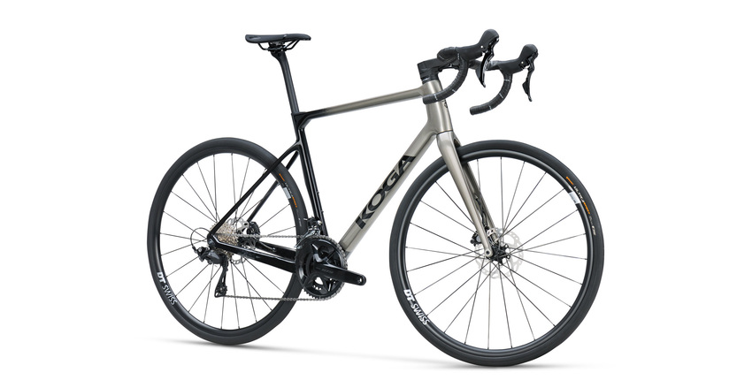

# Koga Roqa Carbon Prestige — New from Dealer

**Price:** €1,999–€2,399 (multiple dealer listings)  
**Seller:** Fietscentrum Zuidlaren (€1,999) / Fietsshop Kuijper Sassenheim (€2,399)  
**Condition:** New  
**Link:** [View on Marktplaats (search)](https://www.marktplaats.nl/l/fietsen-en-brommers/fietsen-racefietsen/q/koga+roqa+carbon+prestige/)

---

## Specs

| Component | Detail |
|---|---|
| **Frame** | Koga Full Carbon (endurance geometry) |
| **Fork** | Full Carbon |
| **Groupset** | Shimano 105 R7100, 2×12 mechanical |
| **Crankset** | 50/34T |
| **Cassette** | 11-34T (1:1 low gear ✓) |
| **Brakes** | Shimano 105 hydraulic disc |
| **Wheels** | DT Swiss P1800 Spline 32 |
| **Tyres** | Continental Ultra Sport III 700×32C |
| **Seatpost** | KOGA ROQA 31.8 mm |
| **Weight** | ~8.9 kg |
| **Tyre clearance** | **45 mm** (best in class) |
| **Available sizes** | XS–S–M–L–XL |

## Alpe d'Huez Assessment

| Requirement | Status |
|---|---|
| **Budget (€2k–€3k)** | ✓ €1,999–€2,399 |
| **Endurance geometry** | ✓ Yes |
| **Disc brakes** | ✓ Shimano 105 hydraulic |
| **Gearing ≤1:1** | ✓ 34/34 = 1.0 (50/34 + 11-34) |
| **Tyre clearance ≥32mm** | ✓ **45 mm** (huge) |
| **Carbon frame** | ✓ |

## Pros

- **45 mm tyre clearance** — class-leading, can run 35-40 mm tyres for maximum comfort on rough alpine descents
- **Dutch brand** — good dealer network in NL for warranty/service
- **€1,999 price** — cheapest new carbon endurance bike with disc brakes and 105 in this research
- **DT Swiss E1800/P1800 wheels** — quality wheelset, better than many competitors' house-brand wheels
- **1:1 climbing gear** ready out of the box
- **Versatile** — can convert to gravel with tyre swap (45 mm clearance)
- **Full manufacturer warranty** (24 months)

## Cons

- **Mechanical shifting** — no Di2 at this price point (Cube Attain C:62 SLX has Di2 for €2,499)
- **8.9 kg** — not light; heavier than Cube Attain C:62 SLX (8.4 kg) and Canyon Endurace CF 7 (8.6 kg)
- **Size L only** (€1,999 listing) — limited size availability on the cheapest deal
- **51 cm frame** (€2,399 listing) — smaller size, check fit
- **Shimano 105 2×12** is excellent but the groupset is the same as competitors at similar prices

## Gearing Detail

The 50/34 + 11-34 combo gives **1:1 lowest gear** (34/34). For Alpe d'Huez this is adequate. Consider an 11-36 cassette swap (+€60-100) if you're a lighter rider or want extra margin on the steepest 13% sections.

## Why the Clearance Matters

The 45 mm tyre clearance is unique at this price. It means you can:
- Run 35-38 mm road tyres for alpine comfort without sacrificing speed
- Fit gravel tyres for training/mixed terrain
- Use wider tubeless setups at lower pressures for better grip on descents

No other bike in this comparison offers this much clearance under €2,500.

## Comparison to Cube Attain C:62 SLX (€2,499)

| Factor | Koga Roqa Prestige | Cube Attain C:62 SLX |
|---|---|---|
| **Price** | **€1,999** (€500 less) | €2,499 |
| **Groupset** | 105 mechanical | **105 Di2** (electronic) |
| **Weight** | 8.9 kg | **8.4 kg** |
| **Tyre clearance** | **45 mm** ★ | 34 mm |
| **Wheels** | **DT Swiss P1800** | Merida Expert SLII |
| **Frame warranty** | 24 months | **6 years** (Cube) |

The Koga is a brilliant deal at €1,999 if you don't need Di2. The tyre clearance is unmatched. But the Cube has better shifting, is lighter, and has a longer warranty.

## Verdict

**Best for:** Riders who value tyre clearance above all else, or who want to occasionally ride gravel. Also great if budget is tight — €1,999 for a new carbon endurance bike with disc brakes is exceptional value.

**Skip if:** You want electronic shifting (Cube Attain C:62 SLX is only €500 more), or you want the lightest bike possible.

---

*Last updated: May 2026 — Listings active at time of writing.*
