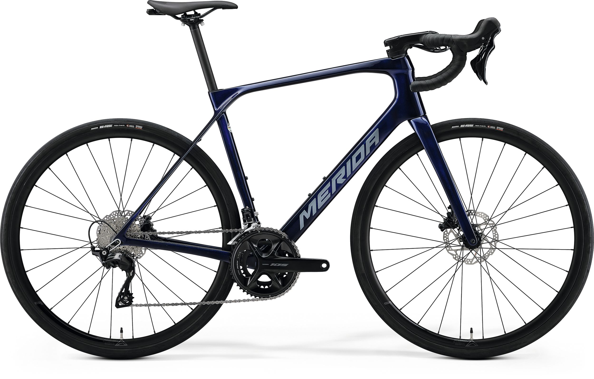

# Merida Scultura Endurance 4000 — New from Dealer

**Price:** €2,399  
**Seller:** Bike Totaal de Jong (Wommels, 18 yr on Marktplaats)  
**Condition:** New  
**Link:** [View on Marktplaats](https://www.marktplaats.nl/v/fietsen-en-brommers/fietsen-racefietsen/m2373308464-nieuwe-merida-scultura-endurance-4000)

---

## Specs

| Component | Detail |
|---|---|
| **Frame** | CF3 Carbon (same as higher models) |
| **Fork** | Scultura Endurance CF3 Disc |
| **Groupset** | Shimano 105 R7100, 2×12 mechanical |
| **Crankset** | 50/34T |
| **Cassette** | 11-34T (1:1 low gear ✓) |
| **Brakes** | Shimano 105 hydraulic disc |
| **Wheels** | Merida Expert SLII, aluminium, tubeless ready |
| **Tyres** | Maxxis Re-Fuse 700×32C |
| **Seatpost** | Merida Expert CC carbon |
| **Weight** | ~9.3 kg |
| **Tyre clearance** | 35 mm |
| **Available sizes** | 3XS–XXS–S–M–L–XL (size L in stock) |

## Alpe d'Huez Assessment

| Requirement | Status |
|---|---|
| **Budget (€2k–€3k)** | ✓ €2,399 |
| **Endurance geometry** | ✓ Stack/reach 1.537 (relaxed) |
| **Disc brakes** | ✓ 160 mm rotors |
| **Gearing ≤1:1** | ✓ 34/34 = 1.0 (50/34 + 11-34) |
| **Tyre clearance ≥32mm** | ✓ 35 mm |
| **Carbon frame** | ✓ CF3 |

## Pros

- **Full carbon frame** at a reasonable price — same CF3 frame as €4k+ models
- **1:1 climbing gear** out of the box — no immediate cassette swap needed for Alpe d'Huez
- **Wire Port cable routing** keeps cockpit clean
- **Carbon seatpost** adds compliance
- **Endurance geometry** — more upright than race bikes, good for long days
- **Bike Radar recommended** (4/5 stars, praised for comfort and value)
- **Dealer warranty** — new bike, full manufacturer guarantee

## Cons

- **9.3 kg** — heavier than the Cube Attain C:62 SLX (8.4 kg) and the top competitors
- **105 mechanical** (not Di2) — still excellent but requires cable maintenance
- **35 mm clearance** is good but behind Giant Defy (40 mm), Trek Domane (38 mm), Roubaix (40 mm)
- **Aluminium wheels** — fine for training, but a carbon upgrade would improve feel
- **Only size L in stock** on this listing — check other sizes with dealer

## Gearing Detail

The 50/34 compact crank + 11-34 cassette gives a 34/34 = **1.0 lowest gear**. This is the minimum recommended for Alpe d'Huez. At 60 rpm on the 13% sections you'll be doing ~5.5 km/h — slow but manageable. If you're a lighter rider (<65 kg) or this is your first alpine triathlon, consider swapping to an 11-36 cassette (+€60-100) for a 0.94 ratio.

## Comparison to Cube Attain C:62 SLX (€2,499)

| Factor | Merida SE 4000 | Cube Attain C:62 SLX |
|---|---|---|
| **Price** | €2,399 | €2,499 |
| **Groupset** | 105 mechanical | **105 Di2** (electronic) |
| **Frame** | CF3 Carbon | C:62 Carbon |
| **Weight** | 9.3 kg | **8.4 kg** (0.9 kg lighter) |
| **Tyre clearance** | 35 mm | 34 mm |
| **Gearing** | 50/34 + 11-34 (1:1) | 50/34 + 11-34 (1:1) |

The Cube is 0.9 kg lighter and has Di2 for only €100 more. The Merida's main advantage is price — it's the cheapest full-carbon endurance bike on this list.

## Verdict

**Best for:** Riders who want a full-carbon endurance bike new within budget and don't mind mechanical shifting. The 1:1 gearing is ready to go.

**Skip if:** You want electronic shifting (get the Cube Attain C:62 SLX for €100 more), or you want the lightest possible bike (Cube is 0.9 kg lighter).

---

*Last updated: May 2026 — Listing active at time of writing.*
